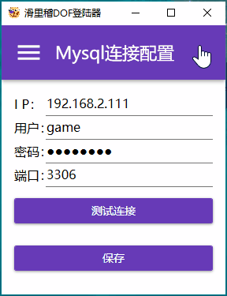

# 滑里稽登陆器

使用.Net5  WPFApp 单文件构建;

界面采用MaterialDesign风格;

异步编程;

需要安装[.Net5 x86](https://dotnet.microsoft.com/download/dotnet/5.0/runtime/?utm_source=getdotnetcore&utm_medium=referral);

和DNF.exe放在同一目录;

不含免Host,输入法等插件;

程序未加密,建议只在单人游戏使用;

自动保存用户名密码;

建议配合'[DOF补丁大合集](https://tieba.baidu.com/p/7223922234?pid=137874844872&cid=#137874844872)'使用;

有BUG问题请到Gihub发 [Issues](https://github.com/nnn149/DofLauncher/issues) ;

下载地址：

release：https://github.com/nnn149/DofLauncher/releases

蓝奏云(内含DOF补丁大合集)：https://nnn149.lanzous.com/b0dku04be  密码:dz9b

### 演示

### 相关

openssl生成rsa

私钥生成 `openssl genrsa -out rsa_2048_priv.pem 2048`

公钥生成 `openssl rsa -pubout -in rsa_2048_priv.pem -out publickey.pem`

相关链接: 

openssl： https://github.com/openssl-net/openssl-net

DOF补丁大合集：https://tieba.baidu.com/p/7223922234?pid=137874844872&cid=#137874844872

.Net5 Run：https://dotnet.microsoft.com/download/dotnet/5.0/runtime/?utm_source=getdotnetcore&utm_medium=referral

服务端 https://github.com/nnn149/dofServer
